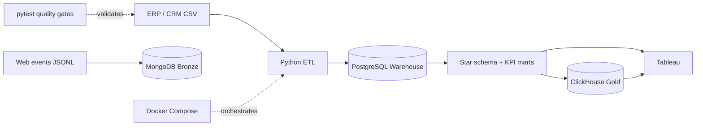

# NovaMart Europe Analytics Platform

I built NovaMart as a production-style portfolio project based on a fully synthetic omnichannel retail dataset. In this project, I developed an end-to-end analytics platform that transforms imperfect source data into trusted analytical datasets and business dashboards.

## Architecture



## What I implemented

- I designed a dimensional model and analytical marts in SQL.
- I built data ingestion, cleaning and reconciliation processes with Python and Pandas.
- I implemented a relational warehouse in PostgreSQL.
- I used MongoDB to store and index raw web events.
- I created a ClickHouse serving layer for aggregated analytical data.
- I packaged the infrastructure with Docker Compose for reproducible deployment.
- I added automated data-quality tests and a GitHub Actions CI workflow.
- I prepared KPI datasets and Tableau dashboards for business reporting.

## Quick start on Windows

```powershell
git clone https://github.com/Mishin-18/novamart-retail-analytics.git
cd novamart-retail-analytics
.\run_project.ps1
```

The first run downloads container images and may take several minutes. Subsequent runs reuse the volumes.

Requirements: Docker Desktop with Docker Compose and PowerShell 7 or Windows PowerShell 5.1.

## Portfolio deliverables

- `NovaMart_Portfolio_Dashboard_Enhanced.twbx` — primary Tableau portfolio dashboard
- `NovaMart_Executive_Dashboard.twbx` — executive KPI dashboard
- `NovaMart_Data_Guide.xlsx` — data dictionary and dataset guide
- `sql/postgres/warehouse.sql` — warehouse, star schema and analytical marts
- `src/pipeline.py` — reproducible Python ingestion and transformation pipeline
- `tests/` and `.github/workflows/quality.yml` — automated source-data quality gates
- `docs/TABLEAU_GUIDE.md` — Tableau usage notes

## Service endpoints

| Service | Endpoint | Purpose |
|---|---|---|
| PostgreSQL | localhost:5433 | warehouse and Tableau marts |
| MongoDB | localhost:27018 | raw web events |
| ClickHouse | localhost:8124 | high-speed KPI serving |

The repository contains demo-only local credentials for disposable Docker services. Do not reuse them outside this project.

## Data-quality story

I intentionally designed the raw layer with realistic data-quality problems: 250 duplicate order rows, 90 invalid quantities, 185 missing cities and 94 repeated emails. I built the pipeline to deduplicate orders, quarantine invalid quantities, flag repeated emails and recalculate sales totals before publishing trusted KPIs.

## What this project demonstrates

Through NovaMart, I demonstrate that I can:

- take ownership of an analytics solution from raw data to business reporting;
- investigate and resolve data-quality issues instead of assuming clean inputs;
- design data models and trusted analytical datasets for BI users;
- combine Python, SQL, databases and visualization tools in one workflow;
- automate infrastructure, validation and continuous integration;
- translate technical data processing into clear and actionable business KPIs.

All people, companies, emails and transactions are fictional. No confidential employer data is included.
