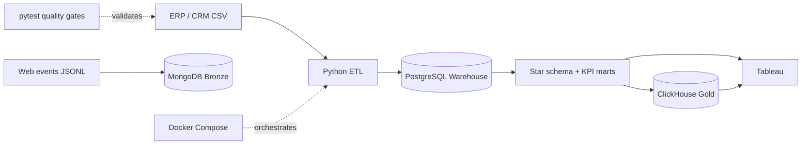

# NovaMart Europe Analytics Platform

Production-style portfolio project demonstrating an end-to-end data platform on a fully synthetic omnichannel retail dataset. The project is designed for Data Analyst, BI Analyst, Analytics Engineer and Data Engineer interviews.

## Architecture



## Demonstrated skills

- SQL dimensional modelling and analytical marts
- Python/Pandas ingestion and reconciliation
- PostgreSQL relational warehouse
- MongoDB event storage and indexes
- ClickHouse analytical serving layer
- Docker Compose reproducible infrastructure
- automated data-quality tests and GitHub Actions CI
- Tableau-ready KPI outputs

## Quick start on Windows

```powershell
git clone https://github.com/Mishin-18/novamart-retail-analytics.git
cd novamart-retail-analytics
.\run_project.ps1
```

The first run downloads container images and may take several minutes. Subsequent runs reuse the volumes.

Requirements: Docker Desktop with Docker Compose and PowerShell 7 or Windows PowerShell 5.1.

## Portfolio deliverables

- `NovaMart_Portfolio_Dashboard_Enhanced.twbx` — primary Tableau portfolio dashboard
- `NovaMart_Executive_Dashboard.twbx` — executive KPI dashboard
- `NovaMart_Data_Guide.xlsx` — data dictionary and dataset guide
- `sql/postgres/warehouse.sql` — warehouse, star schema and analytical marts
- `src/pipeline.py` — reproducible Python ingestion and transformation pipeline
- `tests/` and `.github/workflows/quality.yml` — automated source-data quality gates
- `docs/TABLEAU_GUIDE.md` — Tableau usage notes

## Service endpoints

| Service | Endpoint | Purpose |
|---|---|---|
| PostgreSQL | localhost:5433 | warehouse and Tableau marts |
| MongoDB | localhost:27018 | raw web events |
| ClickHouse | localhost:8124 | high-speed KPI serving |

The repository contains demo-only local credentials for disposable Docker services. Do not reuse them outside this project.

## Data-quality story

The raw layer intentionally contains 250 duplicate order rows, 90 invalid quantities, 185 missing cities and 94 repeated emails. The pipeline deduplicates orders, quarantines invalid quantities, flags repeated emails and recalculates sales totals. This creates a realistic interview narrative: ingest imperfect source data, reconcile it, model it and publish trusted KPIs.

## Recruiter demo script

1. Show the architecture diagram and `docker compose ps`.
2. Open the raw data-quality controls.
3. Explain Bronze → Warehouse → Gold transformations.
4. Run one PostgreSQL KPI query and the same ClickHouse mart.
5. Present the Tableau executive dashboard.
6. Finish with the CI test workflow and reproducible one-command setup.

All people, companies, emails and transactions are fictional. No confidential employer data is included.
